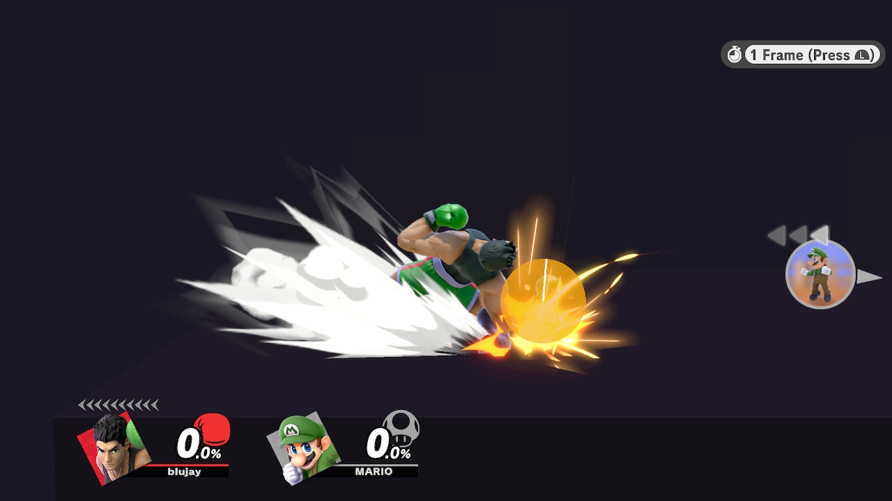
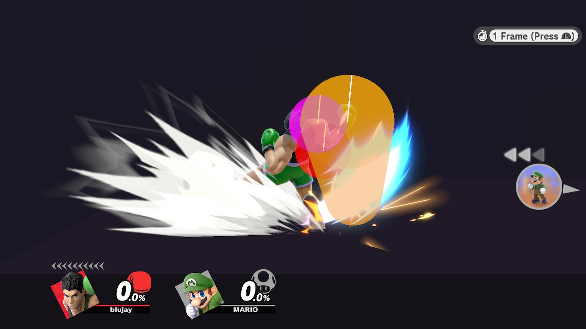
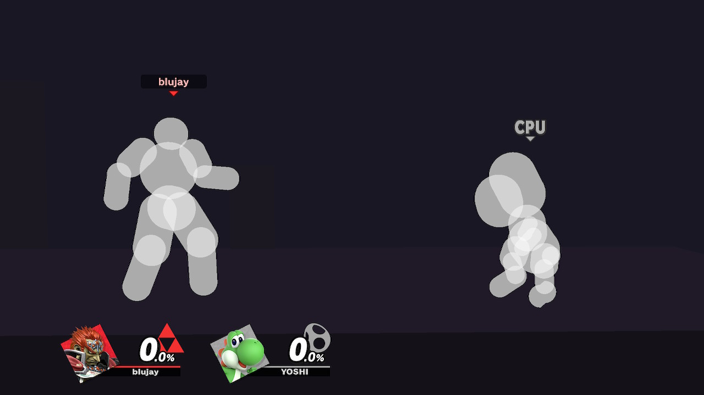
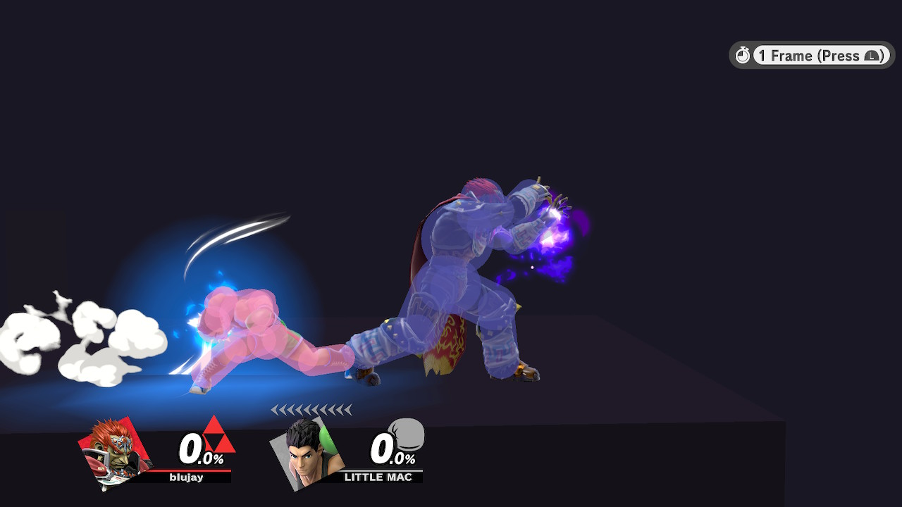
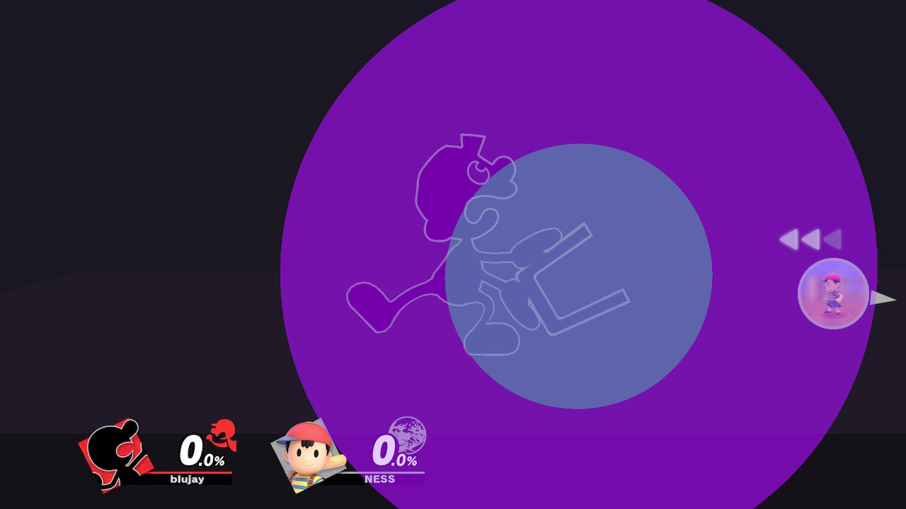
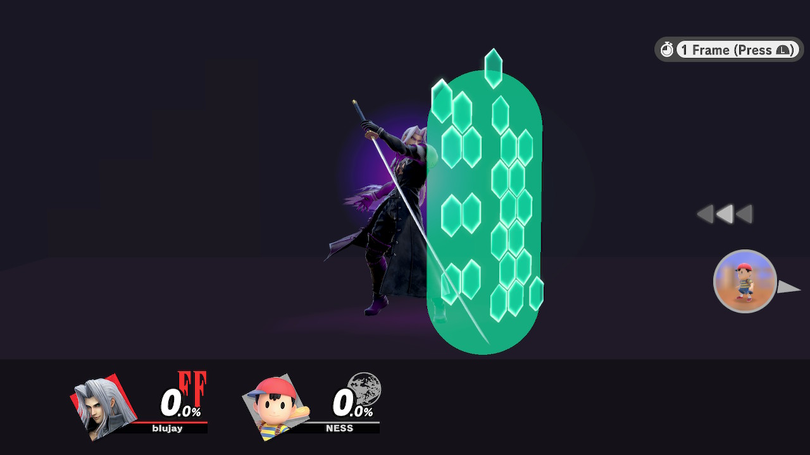

# smash-visualizer
A visualizer for Smash Ultimate hitboxes, hurtboxes, and shield boxes

## Hitboxes
8 ID dividers, interpolation, proper capsules, angle visualization, angles, and more! Also, no more improper visuialization with stretched animations!
 
## Hurtboxes
Different colors for normal status, hitstun, intangibility, invulnerability, super armor, subtractive armor (Yoshi double jump), and heavy armor!

## Shield boxes
Still a WIP feature, but visualizes shield boxes (character shields, Links/Hero shield, King K. Rool belly armor, and counters), reflectors, and absorbers!

